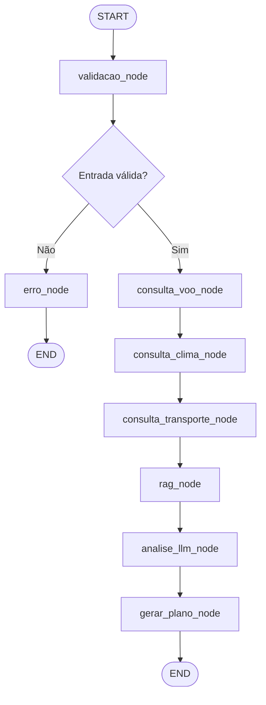

# ✈️ Viagem Inteligente — Gestão Automatizada de Crises em Itinerários

[](https://www.python.org/downloads/)
[](https://github.com/langchain-ai/langgraph)
[](https://console.groq.com/)
[](#licença)

## Visão Geral

Agente inteligente que automatiza a gestão de crises em itinerários de viagem, oferecendo respostas em segundos ao consolidar informações de múltiplas fontes e gerar planos de contingência personalizados.

Desenvolvido como Mini-Projeto do **Módulo 2 — Curso de IA SCTEC**.

## O Problema

Milhões de viajantes enfrentam diariamente atrasos, cancelamentos de voos, condições climáticas extremas e perdas de conexão. O atendimento tradicional das companhias aéreas pode levar horas em filas ou ao telefone, deixando o passageiro sem orientação clara sobre seus direitos, opções de reembolso e rotas alternativas.

## A Solução

Um agente conversacional que:

1. **Detecta** a situação do viajante a partir de linguagem natural
2. **Consulta APIs** para status de voo, clima e transporte alternativo
3. **Recupera políticas** e legislação via RAG (Resolução ANAC 400/2016)
4. **Gera planos de contingência** personalizados em Markdown
5. **Responde perguntas simples** (data, hora, clima) diretamente sem plano completo
6. **Mantém memória** da conversa para interações contínuas

## Quick Start

```bash
# 1. Clone e entre no diretório do projeto
cd "Mini-Projeto"

# 2. Crie ambiente virtual
python -m venv venv
venv\Scripts\activate        # Windows
# source venv/bin/activate   # Linux/Mac

# 3. Instale dependências
pip install -r requirements.txt

# 4. Configure a API key
cp .env.example .env
# Edite .env com sua GROQ_API_KEY

# 5. Execute
python main.py web           # Interface Gradio → http://localhost:7860
python main.py cli ABC123 "Meu voo foi cancelado"  # Via terminal
```

> Para instruções detalhadas de instalação, veja [INSTALLATION.md](INSTALLATION.md).

## Arquitetura do Agente

### Fluxo LangGraph (StateGraph com 8 nós)



### Nós do Grafo

| # | Nó | Função |
|---|-----|--------|
| 1 | `validacao` | Extrai código de reserva, valida formato/domínio, gerencia memória de sessão |
| 2 | `consulta_voo` | Consulta status na base simulada (número, origem, destino, horários, status) |
| 3 | `consulta_clima` | Consulta API Open-Meteo (temperatura, condição, vento, visibilidade, alertas) |
| 4 | `consulta_transporte` | Busca alternativas (voos, ônibus, trens) ordenadas por duração |
| 5 | `rag` | Recupera políticas e legislação via busca semântica TF-IDF |
| 6 | `analise_llm` | Síntese contextual com LLM (identificação de pontos críticos) |
| 7 | `gerar_plano` | Gera plano de contingência ou resposta direta conforme tipo de pergunta |
| 8 | `erro` | Retorna mensagem amigável com orientação ao usuário |

### Estado Compartilhado (TypedDict)

```python
class EstadoCrise(TypedDict):
    messages: Annotated[list, add_messages]  # Histórico do chat
    codigo_reserva: str          # Código validado (6 chars A-Z0-9)
    mensagem_usuario: str        # Descrição da situação
    status_voo: dict             # Dados do voo
    info_clima: dict             # Condições climáticas
    alternativas_transporte: list # Opções de transporte
    politicas_recuperadas: list  # Documentos RAG - políticas
    direitos_passageiro: list    # Documentos RAG - direitos
    relatorio_final: str         # Plano gerado em Markdown
    erros: list                  # Erros registrados
    validacao_ok: bool           # Flag de validação
```

## Stack Tecnológica

| Tecnologia | Função |
|-----------|--------|
| **LangGraph** (StateGraph) | Orquestração do fluxo com controle de nós e arestas |
| **ChatGroq** (Llama 3.3 70B) | LLM para análise e geração de planos |
| **Open-Meteo API** | Clima em tempo real (gratuita, sem API key) |
| **Gradio 4+** | Interface web conversacional |
| **scikit-learn** (TF-IDF) | Busca semântica RAG com similaridade cosseno |
| **LangChain Core** | Tools (@tool) e tipos de mensagem |
| **python-dotenv** | Gerenciamento de variáveis de ambiente |
| **MemorySaver** | Persistência de estado entre interações |

## Uso

### Entrada

```
ABC123 Meu voo foi cancelado por mau tempo e vou perder minha conexão para o Rio.
```

- `ABC123` — código de reserva (6 caracteres alfanuméricos)
- Restante — descrição da situação em linguagem natural

### Modos de Resposta

| Tipo de Pergunta | Exemplo | Resposta |
|-----------------|---------|----------|
| **Crise** | "Meu voo foi cancelado" | Plano completo (5 seções) |
| **Pergunta simples** | "Qual a hora do meu voo?" | Resposta direta e concisa |
| **Clima por cidade** | "Previsão do tempo em Curitiba" | Clima direto (sem código) |
| **Clima do destino** | "Tempo no destino?" | Usa destino da memória |

### Exemplo de Plano de Contingência

```markdown
## 1. Diagnóstico da Situação
- Voo LA3456 (GRU → GIG) cancelado por condições meteorológicas adversas.
- Horário original: 15/01/2025 às 14h30.
- Conexão para o Rio comprometida.

## 2. Direitos do Passageiro
- Resolução ANAC 400 garante assistência material imediata.
- Comunicação gratuita, alimentação após 2h, hospedagem se pernoite.

## 3. Opções de Reembolso
- Reembolso integral em até 7 dias úteis.
- Reacomodação no próximo voo sem custo.

## 4. Rotas Alternativas
- [VOO] Partida: 18:00 | Duração: 1h15min
- [ÔNIBUS] Partida: 16:30 | Duração: 6h00min

## 5. Recomendações Imediatas
- Dirija-se ao balcão para reacomodação.
- Guarde comprovantes para reembolso posterior.
```

## Funcionalidades Inteligentes

- **Memória de sessão** — código de reserva informado uma vez é reutilizado nas próximas perguntas
- **Detecção de intenção** — distingue perguntas simples de crises automaticamente
- **Consulta de clima sem código** — basta mencionar a cidade
- **Resiliência** — se um nó falha, o fluxo continua com dados parciais
- **Validação de domínio** — rejeita mensagens fora do contexto de viagem

## Estrutura do Projeto

```
Mini-Projeto/
├── src/
│   ├── __init__.py
│   ├── agente.py              # Agente principal com StateGraph (8 nós)
│   ├── estado.py              # TypedDict do estado compartilhado
│   ├── validacao.py           # Validação de entrada (código, mensagem, domínio)
│   ├── ferramentas/
│   │   ├── __init__.py
│   │   ├── voo.py             # Status de voo (base simulada)
│   │   ├── clima.py           # Clima via Open-Meteo API
│   │   └── transporte.py     # Transporte alternativo (base simulada)
│   ├── rag/
│   │   ├── __init__.py
│   │   ├── documentos.py     # Base de políticas e legislação (10 docs)
│   │   └── busca.py          # Busca semântica TF-IDF + cosseno
│   └── interface/
│       ├── __init__.py
│       ├── gradio_app.py     # Interface web Gradio
│       └── cli.py            # Interface CLI
├── tests/                     # Testes unitários
├── docs/
│   └── Prompts/              # System prompts documentados
├── .env.example              # Template de variáveis de ambiente
├── .gitignore
├── requirements.txt          # Dependências Python
├── main.py                    # Entry point (web/cli)
├── INSTALLATION.md           # Guia detalhado de instalação
├── PRD.md                    # Product Requirements Document
├── product.md                # Visão do produto e roadmap
├── Requisitos.docx           # Requisitos do projeto
└── README.md                 # Este arquivo
```

## Decisões de Design

### Dados simulados (voos e transporte)
- Resultados determinísticos para testes e demonstrações acadêmicas
- Em produção, bastaria substituir a fonte mantendo a mesma interface

### TF-IDF para RAG (em vez de embeddings densos)
- Dependências leves (scikit-learn vs modelos de GB)
- Suficiente para ~10 documentos de políticas
- Sem API key adicional ou download de modelos pesados

### Detecção de intenção via regex (em vez de classificador ML)
- Latência zero — decisão em código antes de chamar o LLM
- Padrões bem definidos e testáveis para o escopo do projeto

## Limitações

| Limitação | Impacto | Evolução |
|-----------|---------|----------|
| Dados de voo simulados | Não reflete tempo real | Integrar FlightAware/Amadeus |
| TF-IDF para RAG | Limitado em consultas ambíguas | Migrar para embeddings semânticos |
| Escopo de 8 aeroportos | Cobertura regional | Expandir base de coordenadas |
| Sessão em memória | Perde estado ao reiniciar | Persistir em banco de dados |
| Dependência de GROQ_API_KEY | Sem fallback se indisponível | Adicionar provider alternativo |

## Códigos de Reserva para Testes

| Código | Voo | Origem | Destino | Status | Motivo |
|--------|-----|--------|---------|--------|--------|
| `ABC123` | LA3456 | GRU | GIG | Cancelado | Condições meteorológicas adversas |
| `DEF456` | G3 1020 | BSB | SSA | Atrasado | Manutenção não programada (2h) |
| `GHI789` | AD4512 | CNF | GRU | Confirmado | N/A |
| `JKL012` | LA1234 | GIG | BSB | Embarcando | N/A |
| `MNO345` | G3 2078 | CWB | POA | Cancelado | Neblina intensa no destino |
| `XYZ789` | LA5678 | GRU | GIG | Atrasado | Conexão perdida em BSB |

### Exemplos de teste rápido

```
ABC123 Meu voo foi cancelado por mau tempo e vou perder minha conexão para o Rio.
DEF456 Estou no aeroporto de Brasília e meu voo atrasou mais de 4 horas.
MNO345 Meu voo está cancelado por neblina e preciso chegar a Porto Alegre urgente.
GHI789 qual a data e hora do meu voo?
XYZ789 quais meus direitos por atraso?
```

## Testes

```bash
# Executar todos os testes
pytest tests/ -v

# Executar teste específico
pytest tests/test_validacao.py -v
```

## Documentação Adicional

- [INSTALLATION.md](INSTALLATION.md) — Guia completo de instalação e configuração
- [PRD.md](PRD.md) — Product Requirements Document
- [product.md](product.md) — Visão do produto e roadmap
- [Requisitos.docx](Requisitos.docx) — Requisitos do projeto
- [docs/Prompts/](docs/Prompts/) — Prompts e decisões técnicas documentadas

## Licença

Projeto acadêmico desenvolvido para o Módulo 2 (Mini-Projeto) do curso de IA SCTEC.
